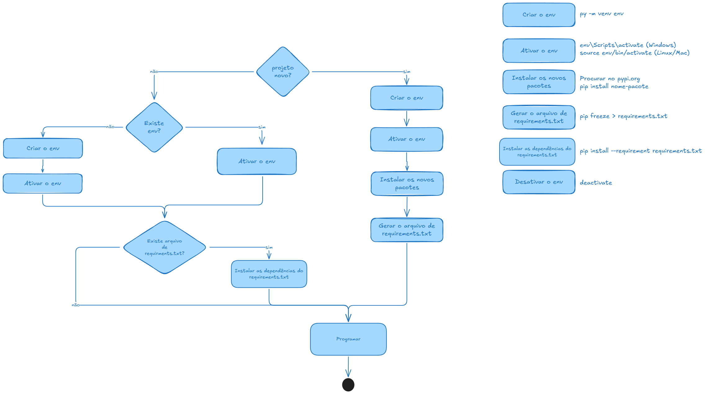

# Preparação do ambiente do Python

## Requisitos
- Python instalado
- MySQL instalado



## Criar um ambiente de desenvolvimento (venv) 

venv (virtual environment): nele serão instalados todas as dependencias que nosso projeto terá

## Não tenho o ambiente criado, sem o arquivo de requirements.txt(projeto novo)
Criar o venv:
```
py -m venv env
```

Ativar o venv:
```
env\Scripts\activate
```
Se der erro na ativação: Habilitar no PowerShell como administrador para poder habilitar o env do python:
```
Set-ExecutionPolicy Unrestricted -Force
```

Agora vc pode programar/instalar os pacotes necessários

## Não tenho o ambiente criado, tenho o arquivo de requirements.txt
Criar o venv:
```
py -m venv env
```

Ativar o venv:
```
env\Scripts\activate
```
Se der erro na ativação: Habilitar no PowerShell como administrador para poder habilitar o env do python:
```
Set-ExecutionPolicy Unrestricted -Force
```

Instalar as dependencias do requirements.txt
```
pip install -r requirements.txt
```


## Como instalar um pacote? Procurar o pacote no pypi.org 
```
pip install mysql-connector-python
```

Atualizar o arquivo de requerimentos(é uma lista de todos os pacotes que o projeto necessita)
```
pip freeze > requirements.txt
```

## Como desativar o env?
```
deactivate
```


## Tenho o ambiente criado
Ativar o venv:
```
env\Scripts\activate
```